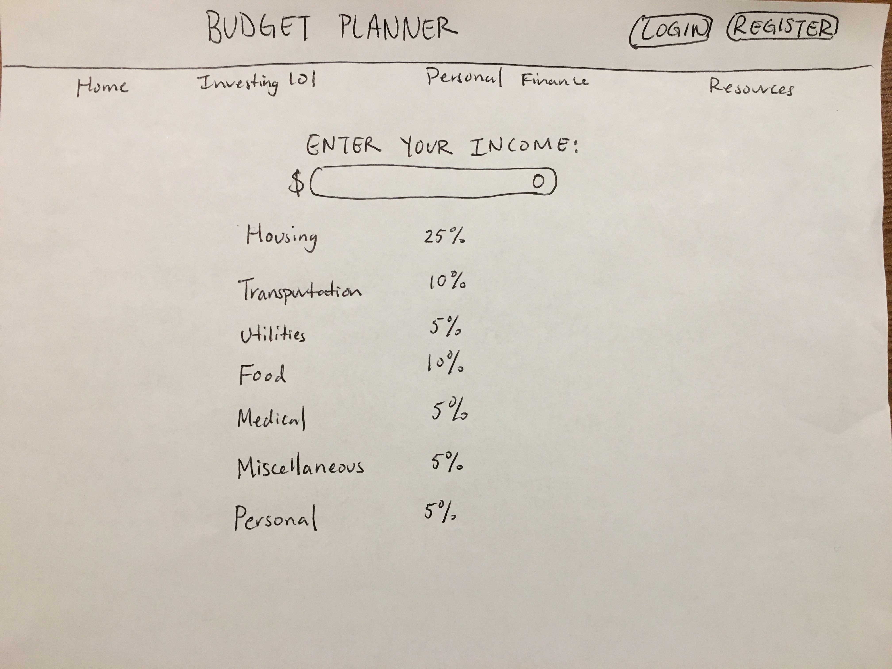
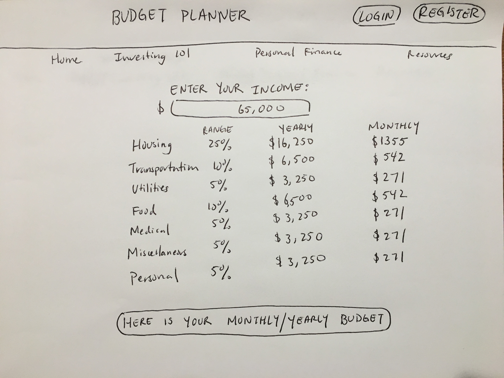

# Budget Planner Proposal

## What is Budget Planner?

Budget Planner is an web application that allows users to record their daily expenses. The idea behind this concept is that if users have to record their expenses, they will become more aware of their spending habits. Budger Planner also provides resources and insights into millennial investing. 

## Wireframe

Current Web App Content: 

Stretch Goal: 

## User Stories

On the homepage, the user can simply type in their yearly income and have a yearly/monthly budget calculated for them. 

In addition, the user will have access to resources such as access to basic investing information, personal finance, and links to financial tools.

## Phases of Completion

### Phase 0 
- Initial setup of app
    - Create all necessary files and folders.

### Phase 1
- Set up Rails 
    - If necessary, create database using Active Records

### Phase 2
- Set up React
    - Set up front-end, possibly auth

### Phase 3
- Set up CRUD

### Phase 4 
- Set up layout of app
    -Work on other tabs of the app

### Phase 5
- Style app

### Phase 6 
- Host app

## Challenges 

A big challenge will be creating the necessary functions to calculate monthly and yearly budgets. 

## Links and Resources

* [How to Add React to a Ruby on Rails Application](https://www.youtube.com/watch?v=pVHEPf7S88I)
* [Beginner Rails 5 With ReactJS Tutorial](https://www.youtube.com/watch?v=PIel9V6JImc&t=8s)
* [Codecademy: Learn Ruby](http://www.builtinnyc.com/job/junior-developer-0)
