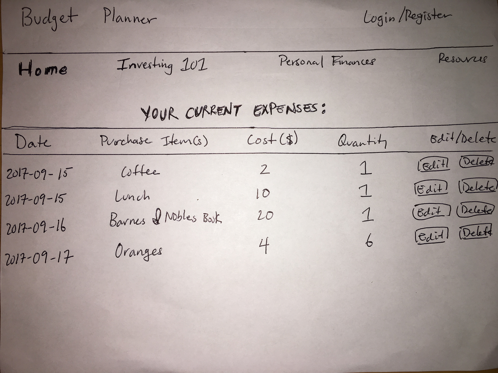

# Budget Planner Proposal

## What is Budget Planner?

Budget Planner is a financial calculator that calculates your monthly budget base on your yearly income. Budget Planner gives users an estimated monthly budget on how much an individual should be spending on housing, transportation, utilities, food, medical, miscellaneous, and personal expenses.

## Wireframe

## User Stories

On the homepage, the user can simply type in their yearly income and have a yearly/monthly budget calculated for them. 

In addition, the user will have access to resources such as access to basic investing information, personal finance, and links to financial tools.

## Phases of Completion

### Phase 0 
- Initial setup
    - Create all necessary files and folders.

### Phase 1
- Set up Rails 
    - If necessary, create database using Active Records

### Phase 2
- Set up React
    - Set up front-end, possibly auth

### Phase 3
- Create functions to calculate yearly budget expenses

### Phase 4 
- Create functions to calculate monthly budget expenses

### Phase 5
- Style app

## Challenges 

A big challenge will be creating the necessary functions to calculate monthly and yearly budgets. 

## Links and Resources
